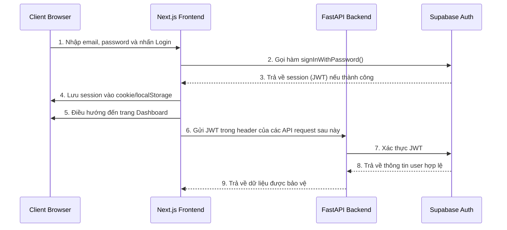
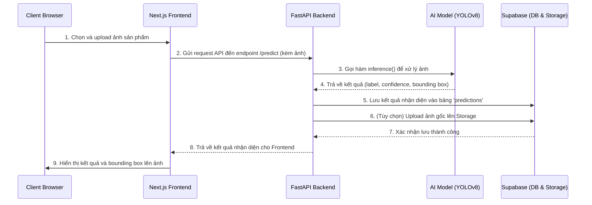
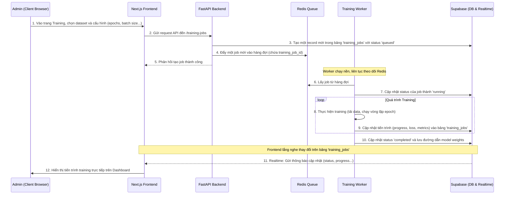
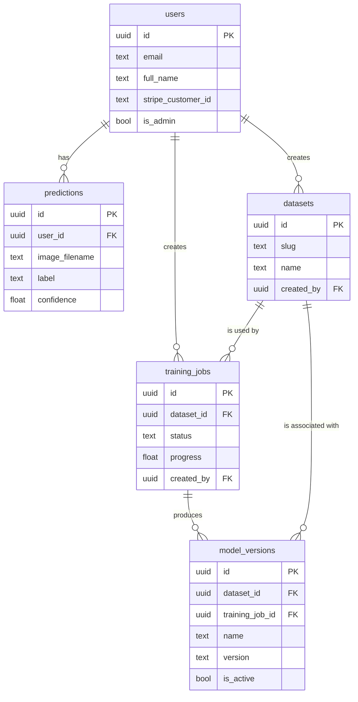

# Chương 3: Phân Tích và Thiết Kế Hệ Thống

Chương này trình bày chi tiết về thiết kế kiến trúc của hệ thống VisionInspect, bao gồm kiến trúc tổng thể, các luồng dữ liệu chính và thiết kế cơ sở dữ liệu.

## 3.1. Sơ đồ kiến trúc tổng thể

Hệ thống VisionInspect được thiết kế theo kiến trúc hướng dịch vụ (Service-Oriented Architecture), gần với microservices, bao gồm các thành phần chính, độc lập và được đóng gói trong các Docker container. Các thành phần này giao tiếp với nhau qua các giao thức chuẩn như HTTP (REST API) và TCP (Redis).

**Sơ đồ kiến trúc tổng thể:**

```mermaid
graph TD
    subgraph "Người dùng"
        Client[<i class='fa fa-user'></i> Client Browser]
    end

    subgraph "Hạ tầng triển khai (VPS/Cloud)"
        Nginx[<i class='fa fa-server'></i> Reverse Proxy <br> (Nginx/Traefik)]
        
        subgraph "Docker Environment"
            direction LR
            Frontend[<i class='fa fa-window-maximize'></i> Frontend <br> (Next.js)]
            Backend[<i class='fa fa-cogs'></i> Backend API <br> (FastAPI)]
            Worker[<i class='fa fa-microchip'></i> Training Worker <br> (RQ)]
            Redis[<i class='fa fa-database'></i> Redis]
        end
    end

    subgraph "Dịch vụ bên ngoài (BaaS)"
        Supabase[<i class='fa fa-cloud'></i> Supabase]
        Supabase_DB[(<i class='fa fa-database'></i> DB <br> PostgreSQL)]
        Supabase_Auth[(<i class='fa fa-key'></i> Auth)]
        Supabase_Storage[(<i class='fa fa-file-archive'></i> Storage)]
        Supabase_Realtime[(<i class='fa fa-rss'></i> Realtime)]
        Supabase --> Supabase_DB & Supabase_Auth & Supabase_Storage & Supabase_Realtime
    end

    Client -- HTTPS --> Nginx
    Nginx -- "Port 80/443" --> Frontend
    Frontend -- "API Calls" --> Backend
    Backend -- "DB Queries" --> Supabase_DB
    Backend -- "Auth" --> Supabase_Auth
    Backend -- "File Upload" --> Supabase_Storage
    Backend -- "Push Job" --> Redis
    Worker -- "Pop Job" --> Redis
    Worker -- "Update Status" --> Supabase_DB
    Frontend -- "Realtime Update" --> Supabase_Realtime
    Worker -- "Realtime Log" --> Supabase_Realtime

```
*Ghi chú: Em hãy dùng Mermaid.live hoặc các công cụ khác để vẽ sơ đồ này thành hình ảnh và chèn vào báo cáo tại file `hinh_anh/kien_truc_tong_the.png`.*

**Mô tả các thành phần:**
- **Client Browser:** Giao diện người dùng được chạy trên trình duyệt, tương tác với hệ thống.
- **Reverse Proxy (Nginx):** Là cổng vào duy nhất của hệ thống. Nó tiếp nhận tất cả các request từ người dùng, phân phối chúng đến service Frontend hoặc Backend tương ứng, quản lý tên miền và mã hóa SSL/TLS.
- **Frontend (Next.js):** Chịu trách nhiệm hiển thị giao diện người dùng. Giao tiếp với Backend qua REST API để lấy dữ liệu và thực hiện các hành động. Lắng nghe các cập nhật thời gian thực từ Supabase Realtime.
- **Backend (FastAPI):** Chứa logic nghiệp vụ chính của ứng dụng. Cung cấp các API cho Frontend, xác thực người dùng, tương tác với Supabase, và đẩy các tác vụ nặng (như training) vào hàng đợi Redis.
- **Training Worker (RQ):** Một tiến trình chạy nền, liên tục lấy các tác vụ từ Redis để thực thi. Đây là nơi quá trình huấn luyện mô hình AI thực sự diễn ra.
- **Redis:** Đóng vai trò là message broker, lưu trữ hàng đợi các tác vụ training.
- **Supabase:** Nền tảng BaaS cung cấp các dịch vụ cốt lõi:
    - **Database (PostgreSQL):** Lưu trữ toàn bộ dữ liệu của ứng dụng (người dùng, lịch sử nhận diện, datasets, thông tin training...).
    - **Auth:** Xử lý việc đăng ký, đăng nhập và quản lý phiên của người dùng.
    - **Storage:** Lưu trữ các file media như ảnh sản phẩm, ảnh dataset.
    - **Realtime:** Gửi thông báo về sự thay đổi dữ liệu trong database đến các client đang lắng nghe.

## 3.2. Sơ đồ luồng dữ liệu (Data Flow Diagram)

### 3.2.1. Luồng xác thực người dùng (Đăng nhập)


*Ghi chú: Em hãy vẽ lại sơ đồ này và lưu tại `hinh_anh/luong_du_lieu_auth.png`.*

### 3.2.2. Luồng nhận diện ảnh


*Ghi chú: Em hãy vẽ lại sơ đồ này và lưu tại `hinh_anh/luong_du_lieu_predict.png`.*

### 3.2.3. Luồng huấn luyện mô hình AI


*Ghi chú: Em hãy vẽ lại sơ đồ này và lưu tại `hinh_anh/luong_du_lieu_training.png`.*

## 3.3. Thiết kế cơ sở dữ liệu

Cơ sở dữ liệu của hệ thống được quản lý bởi Supabase, sử dụng PostgreSQL. Thiết kế schema được thể hiện qua tệp `supabase_setup.sql`.

### 3.3.1. Sơ đồ quan hệ thực thể (ERD)

Sơ đồ ERD mô tả các thực thể chính và mối quan hệ giữa chúng.

*(Ghi chú: Em cần sử dụng một công cụ như dbdiagram.io, Lucidchart, hoặc Mermaid để vẽ sơ đồ ERD dựa trên các bảng trong file `supabase_setup.sql` và lưu ảnh tại `hinh_anh/erd.png`. Sơ đồ cần thể hiện các bảng và các mối quan hệ khóa ngoại (foreign key) như: `users.id` -> `predictions.user_id`, `users.id` -> `datasets.created_by`, `datasets.id` -> `training_jobs.dataset_id`, etc.)*

**Ví dụ mã Mermaid cho một phần ERD:**


### 3.3.2. Mô tả chi tiết các bảng

Dưới đây là mô tả chi tiết về vai trò của các bảng chính trong cơ sở dữ liệu.

#### a. Nhóm bảng lõi

- **`public.users`**: Lưu trữ thông tin hồ sơ của người dùng, được đồng bộ từ bảng `auth.users` của Supabase. Bảng này chứa các thông tin mở rộng như `full_name`, `stripe_customer_id`, và quyền `is_admin`.
- **`public.predictions`**: Ghi lại lịch sử mỗi lần thực hiện nhận diện, bao gồm thông tin người dùng, ảnh, kết quả (nhãn, độ tin cậy), và thời gian xử lý.
- **`public.subscriptions`**: Quản lý thông tin gói thuê bao của người dùng, tích hợp với Stripe.
- **`public.usage_logs`**: Ghi lại các hành động quan trọng của người dùng trên hệ thống, phục vụ cho việc phân tích và kiểm toán.

#### b. Nhóm bảng cho nền tảng MLOps

- **`public.datasets`**: Lưu trữ metadata cho mỗi bộ dữ liệu huấn luyện, bao gồm tên, mô tả, danh sách các lớp (classes), và đường dẫn lưu trữ.
- **`public.dataset_assets`**: Lưu thông tin chi tiết về từng file (ảnh, nhãn) trong một dataset, bao gồm cả việc nó thuộc tập train, validation hay test.
- **`public.training_jobs`**: Bảng quan trọng nhất của hệ thống MLOps. Nó theo dõi trạng thái của mỗi tác vụ huấn luyện, từ lúc được đưa vào hàng đợi (`queued`), đang chạy (`running`), cho đến khi hoàn thành (`completed`) hoặc thất bại (`failed`). Bảng này cũng lưu lại các siêu tham số (hyperparameters) và các chỉ số hiệu suất (metrics) trong quá trình training.
- **`public.training_logs`**: Ghi lại log chi tiết từ quá trình training, giúp cho việc debug và theo dõi.
- **`public.model_versions`**: Đóng vai trò là một "model registry", lưu trữ thông tin về các phiên bản model đã được huấn luyện thành công, bao gồm đường dẫn đến file trọng số (`.pt`), các chỉ số cuối cùng, và trạng thái `is_active`.
- **`public.deployed_models`**: Ghi lại lịch sử các model đã được kích hoạt để sử dụng cho tính năng nhận diện, tạo ra một "audit trail" về việc model nào đang hoạt động.

Thiết kế cơ sở dữ liệu này rất toàn diện, không chỉ phục vụ cho các chức năng cơ bản của một ứng dụng web mà còn đặt nền móng vững chắc cho một nền tảng MLOps có khả năng mở rộng.
